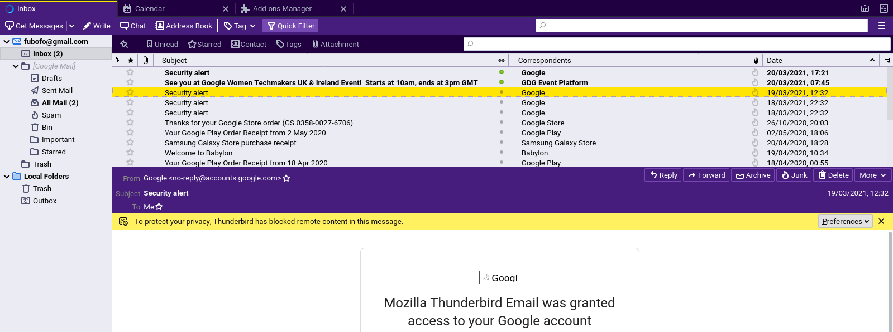
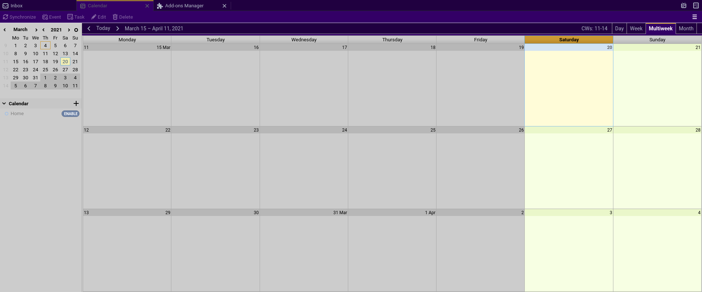
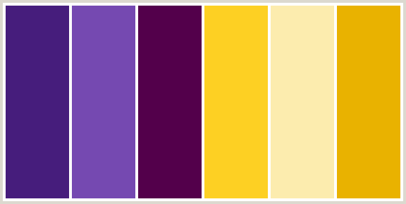
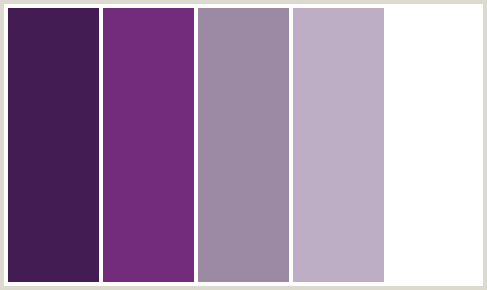

# Purple Praline Thunderbird Theme
A purple theme for Thunderbird 78+.

**Mail**

**Calendar**

## Installation

### Mozilla Add-ons (recommended)

For the easiest way to install and keep updated, install the add-on from within Thunderbird itself using the official Mozilla Add-on store https://addons.thunderbird.net/en-US/thunderbird/addon/purple-praline/.

### Manual

1. Download the [add-on file](https://github.com/kaipee/thunderbird-theme-purple-praline/releases).
1. Install as per the [official instructions](https://support.mozilla.org/en-US/kb/installing-addon-thunderbird#w_a-slightly-less-ideal-case-install-from-a-downloaded-xpi-file).

#### Dev Notes

##### Palettes

**Palette 1**

 * #461D7C
 * #7549B1
 * #53004B
 * #FDD023
 * #FCECAE
 * #E9B200

**Palette 2**

* #421C52
* #732C7B
* #9C8AA5
* #BDAEC6
* #FFFFFF

**Main**
 * 330066
 * 666666

**Additional**
 * CC9933
 * CCCCCC
 * CCFFFF