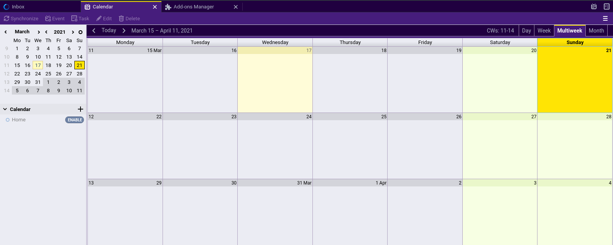

# Purple Praline Thunderbird Theme
A purple theme for Thunderbird 78+.

**Mail**

**Calendar**

## Installation

### Mozilla Add-ons (recommended)

For the easiest way to install and keep updated, install the add-on from within Thunderbird itself using the official Mozilla Add-on store .

### Manual

1. Download the [add-on file](https://github.com/kaipee/thunderbird-theme-purple-praline/releases).
1. Install as per the [official instructions](https://support.mozilla.org/en-US/kb/installing-addon-thunderbird#w_a-slightly-less-ideal-case-install-from-a-downloaded-xpi-file).

#### Dev Notes

**Main**
 * 330066
 * 666666

**Additional**
 * CC9933
 * CCCCCC
 * CCFFFF
